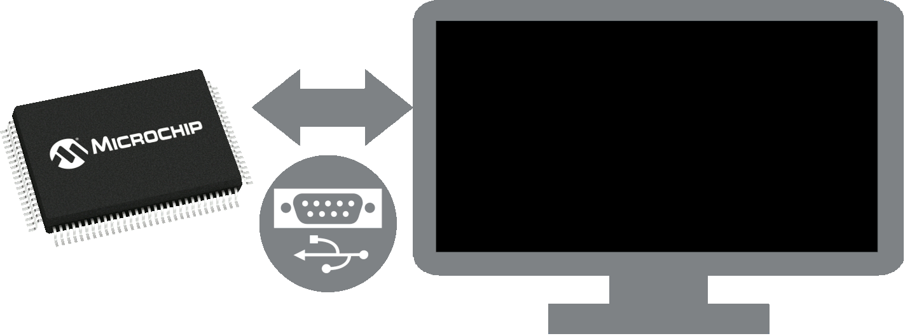

.. image:: images/pyx2cscope_logo.png
   :width: 180
   :alt: pyx2cscope
   :align: left

The pyx2cscope Python package communicates with X2Cscope enabled firmwares running on Microchip microcontrollers.
This comprehensive package offers developers a powerful toolkit for embedded software development, 
combining real-time debugging capabilities with advanced data visualization features directly within
the Python environment.
pyx2cscope makes use of lnet protocol to communicate with the embedded hardware via different communication interfaces
like UART, CAN, LIN, USB, TCP/IP, etc.

pyX2Cscope
==========

pyX2Cscope is the Python implementation of the X2Cscope plugin from MPLABX. This will let the user use the
functionality of X2Cscope even outside MPLABX environment / Standalone. It allows user to:
  * Automated Unit Tests (TDD) using pytest
  * BDD (behavior driven development), Framework: "Cucumber"
  * Different user interface
  * Data collection for machine learning and training models
  * Run-Time data analysis
  * Use of Real Time AI model
  * HiL (Hardware in the loop) testing and tuning

Installation
============

Create a virtual environment and install pyx2cscope using the following commands:

.. code-block:: python

   python -m venv .venv
   source .venv/bin/activate
   pip install pyx2cscope

To check pyx2cscope version, in a terminal, run the following command:

.. code-block:: python

   python -m pyx2cscope --version

For help or additional command line options, type:

.. code-block:: bash

   python -m pyx2cscope --help

Usage
-----

You may try pyX2Cscope either as an API to read and write values from/to variables in a running Microchip
microcontroller, or as a Graphical User Interface (GUI), or both.

The GUI interface
~~~~~~~~~~~~~~~~~

There are currently two implementations, one based on Qt and one Browser based. These GUIs are more examples
on how to implement your own custom interfaces than an official user interface.

To execute Qt version, type:

.. code-block:: bash
   
   python -m pyx2cscope

To execute the Browser based version type:

.. code-block:: bash

   python -m pyx2cscope -w

The API interface
~~~~~~~~~~~~~~~~~

The API interface is managed over the X2CScope class.
The simplest example of the API is depicted below:

.. literalinclude:: ../pyx2cscope/examples/simplest.py
    :language: python
    :linenos:

Following you will find specific information on the API, GUIs, and Firmware implementation.
See the section examples to check some of the usages you may get by pyX2Cscope.

.. toctree::
   :maxdepth: 5
   :caption: Contents:

   how_to
   HW_Support
   example

Indices and tables
==================

* :ref:`genindex`
* :ref:`modindex`
* :ref:`search`

